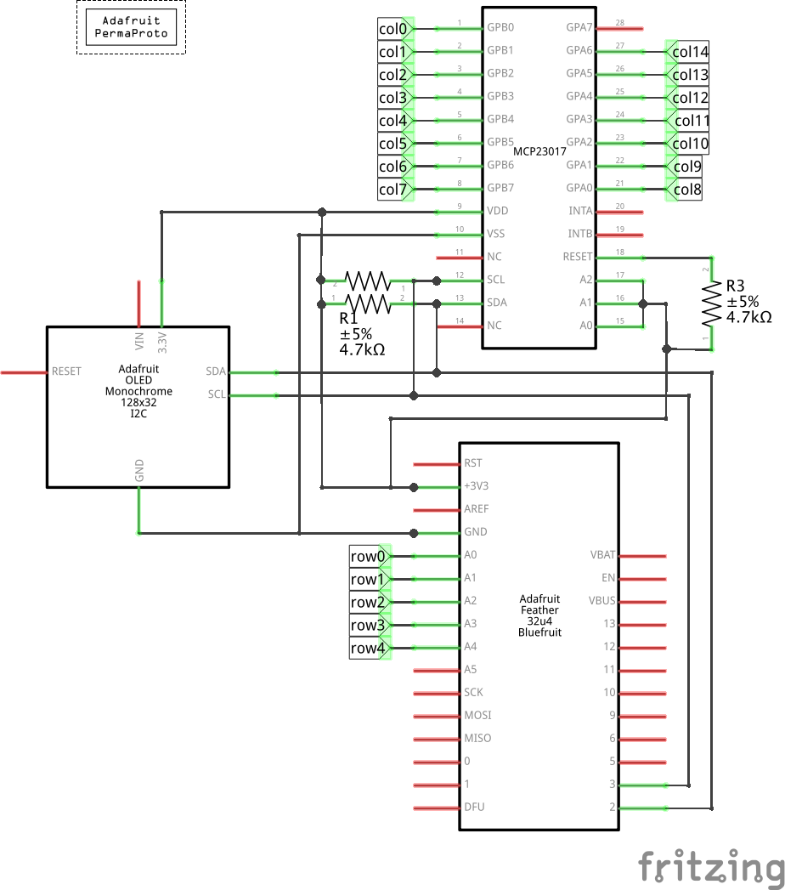

iota keyboard firmware
======================

## iota keyboard

This is my (@wez) first keyboard build from scratch.  It has the following features/components:

- Adafruit Feather 32u4 BLE MCU
- MCP231017 IO expander for extra IO pins (used for the columns of the matrix)
- An SSD1306 OLED display for some basic status

When the keyboard is not connected over USB, and when a battery is attached, it
will send keys over Bluetooth Low Energy (BLE).  The BLE support is what I
consider to be "functional" but not great; there is some latency overhead
that needs to be solved in the firmware on the BLE controller embedded in
the Feather board.  (This is next on my list).

The schematic for this build: 

You will need two pull-up resistors for the I2C bus.  The row/column IO pins
will happily run using the weak internal pull-up resistors in the controllers.

There is no PCB for this build; it is a hand-wired prototype.

## Quantum MK Firmware

For the full Quantum feature list, see [the parent readme](/).

## Building

Download or clone the whole firmware and navigate to the keyboards/iota folder. Once your dev env is setup, you'll be able to type `make` to generate your .hex - you can then use the Teensy Loader to program your .hex file. 

Depending on which keymap you would like to use, you will have to compile slightly differently.

### Default

To build with the default keymap, simply run `make default`.

### Other Keymaps

Several version of keymap are available in advance but you are recommended to define your favorite layout yourself. To define your own keymap create a folder with the name of your keymap in the keymaps folder, and see keymap documentation (you can find in top readme.md) and existant keymap files.

To build the firmware binary hex file with a keymap just do `make` with a keymap like this:

```
$ make [default|jack|<name>]
```

Keymaps follow the format **__\<name\>.c__** and are stored in the `keymaps` folder.
